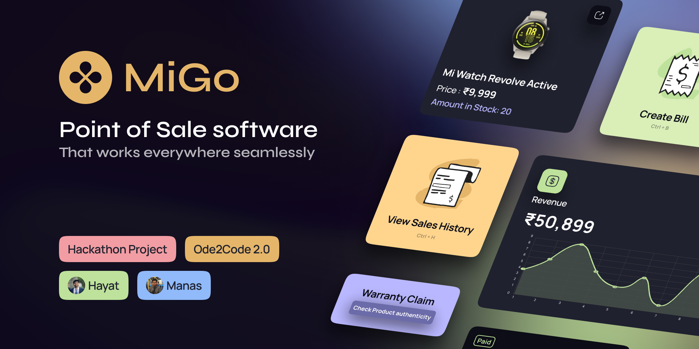

<p align="center">
</a>
</p>
</p>

<p align="center">
<h2 align="center">A POS Software that works everywhere seamlessly</h2>

<div align="center">

[](https://hacknu2-0.github.io/)

</div>

---

## 📝 Table of Contents
- [Problem Statement](#problem_statement)
- [Idea / Solution](#idea)
- [Dependencies / Limitations](#limitations)
- [Future Scope](#future_scope)
- [Usage](#usage)
- [Technology Stack](#tech_stack)
- [Authors](#authors)

<a name="problem_statement"></a>

## 🐱‍👤 Problem Statement

Develop a product that would help Vendors working in Mi Stores 🏪 to easily create bills 💵, check thier sales history and view thier analytics , i.e a useful and usable POS software. Design the experience from the perspective of the Vendor working in a Mi store who wants to keep an easy check of the product inventory and also wants to speed up the process of billing. Identify the pain points in a POS Software and solve these pain points.
<a name="idea"></a>

## 💡 Idea/Solution

We will be creating a POS software which will be a web app, a desktop app that runs on windows, macOS and linux, an android app, and an IOS app, all of these with the same code base using flutter and is supported by a variety of cloud services.

### Feature Ideas
- Authorization- A robust rolebased access control
- A smooth and instructive onboarding - A new user will get a basic instructions on how the app works with the highlights of the application.
- The invoice generation form progress will be saved in cloud in real time so that if the pos device user has to switch to some other device or to some other user the details will be stored.
- We will provide sales analytics which will be powered by AI to give out richer results which will help in optimizing sales also suggesting the user choices.
- improve the user experience of the software and making the software intuitive and allowing frictionless sales
- integrate Customer feedback into POS using Whatsapp and twillo - API and also will analyse the feedback in realtime and will suggest the Mi team regrading the customer expectation.
- Completely Responsive website/app so that sales can happen on the move.
- Real time inventory management with innovative UI.
- Allowing multiple ways for payments and to include credit based setup to buy products.

### Some existing issues
- POS software have a huge learning curve
- POS softwares are laagy and are slow
- They are not usualy responsive and are rarely made for mobile phones
- Inventory management is not real time and cloud support is not that updated
- Can't switch devices in between sales

### Constraints
- Actual Payments
- QR code Scanning
- Budget Constraints
- Time Constraints

<a name="limitations"></a>

## 🚧 Dependencies / Limitations

```dart
  cupertino_icons: ^1.0.2
  # Cool icons
  iconsax: ^0.0.8
  # state management using get
  get: ^4.6.5
  get_storage:
  # To check connectivity
  connectivity_plus: ^2.3.6+1
  # For charts
  fl_chart: ^0.55.1
  syncfusion_flutter_charts: ^20.2.49
  charts_flutter: ^0.12.0
  # sqllite
  sqflite: ^2.0.3+1
  # UI related
  toggle_switch: ^2.0.1
  # to launch url
  url_launcher: ^6.1.5
  # powerful Http client for Dart
  dio: ^4.0.6
  # for printing or converting things to pdf
  printing: ^5.9.3
  # for using razor pay
  razorpay_flutter: ^1.3.2
  permission_handler: ^10.0.0
  quantity_input: ^1.0.2
  flutter_launcher_icons: ^0.10.0
  quick_actions: ^1.0.0
  share_plus: ^4.1.0
  easy_table: ^2.0.1
  introduction_screen: ^3.0.2
```

<a name="future_scope"></a>

## 🔮 Future Scope

- Better analytics 📈📊

## Documentation
- To run the flutter app [Read](#usage)

- The serverside of the application is hosted on ```Heroku```
  - To Access ```Admin``` : [https://backpos.herokuapp.com/admin/](https://backpos.herokuapp.com/admin/)
  - To Read API Docs : 
    - ```Swagger``` : [https://backpos.herokuapp.com/_platform/docs/v1/swagger/](https://backpos.herokuapp.com/_platform/docs/v1/swagger/)
    - ``` Postman``` : [https://documenter.getpostman.com/view/20830684/2s7Ymz8N6s](https://documenter.getpostman.com/view/20830684/2s7Ymz8N6s)


<a name="usage"></a>

## 👷‍♂️ Setup


```sh
flutter pub get
```

## 👷‍♂️ Usage

```sh
flutter run
```

## ✨ Format code

```sh
flutter format .
```

## 🧪 Test

```sh
flutter analyze .
flutter test
```

<a name="tech_stack"></a>

## 💻📱 Technology Stack

- Flutter
  - Dart
- Django Rest Framework
  - Python
  - PostgreSQL
- Heroku
- Postman
- Swagger

<a name="authors"></a>

## 👥 Authors

👤 **Hayat**

* Website: https://hayat.design
* Twitter:
<a href="https://twitter.com/hayattamboli" target="_blank">
    
  </a>
  
* Github: [@hayat-tamboli](https://github.com/hayat-tamboli)
* LinkedIn: [@hayat-tamboli](https://linkedin.com/in/hayat-tamboli)

👤 **Manas**

* Twitter: 
<a href="https://twitter.com/manasgupta1820" target="_blank">
    
  </a>
  
* Github: [@manas1820](https://github.com/manas1820)
* LinkedIn: [@manas-gupta-253760192](https://www.linkedin.com/in/manas-gupta-253760192)


